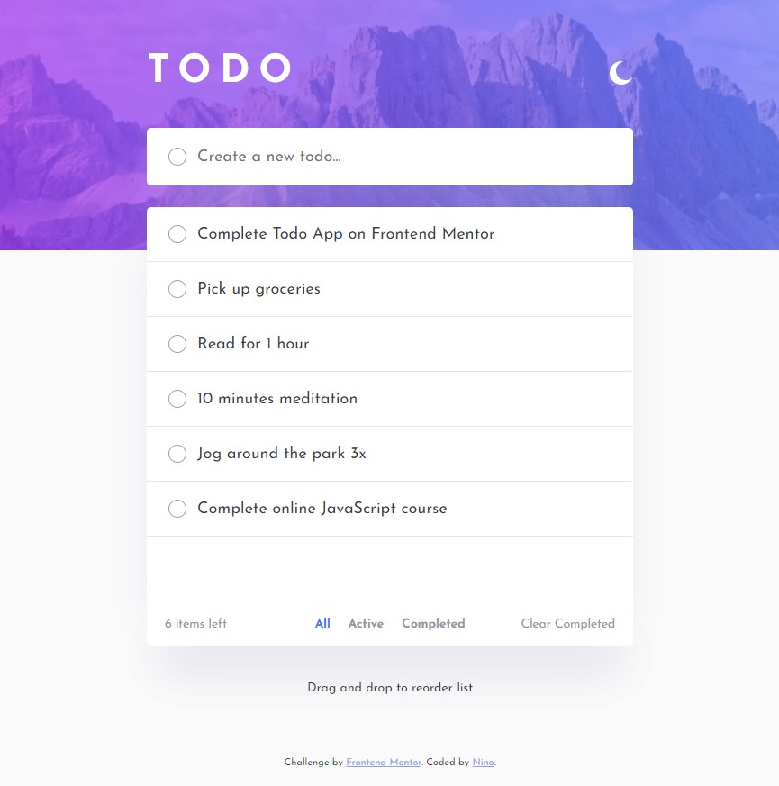

# Todo Application

This is a simple Todo Application that allows users to create and manage their daily tasks. 

## Table of contents

- [Features](#features)
  - [The challenge](#the-challenge)
  - [Screenshot](#screenshot)
  - [Links](#links)
- [My process](#my-process)
  - [Built with](#built-with)
- [Author](#author)

## Features

- Add a new Todo item by either checking the submit checkbox or pressing the ENTER key.
- Delete Todo items by clicking on the 'X' icon next to each item.
- Mark Todo items as complete by checking the checkbox next to each item.
- View all Todo items, active Todo items, or completed Todo items using the 'All', 'Active', and 'Completed' filter buttons.
- Drag and drop function to reorder list

### The challenge

Users should be able to:

- View the optimal layout for the app depending on their device's screen size
- See hover states for all interactive elements on the page
- Add new todos to the list
- Mark todos as complete
- Delete todos from the list
- Filter by all/active/complete todos
- Clear all completed todos
- Toggle light and dark mode
- Drag and drop to reorder items on the list

### Screenshot

### Links

- Solution URL: [GitHub Repository](https://github.com/ninogogol/todo-app-main)
- Live Site URL: [GitHub Page](https://ninogogol.github.io/todo-app-main/)

## My process

### Built with

- Semantic HTML5 markup
- CSS custom properties
- JavaScript
- Flexbox
- Mobile-first workflow
- JS library for drag and drop function

## Author

- Linkedin - [Nino Gogoladze](https://www.linkedin.com/in/nino-gogoladze-80a075227/)